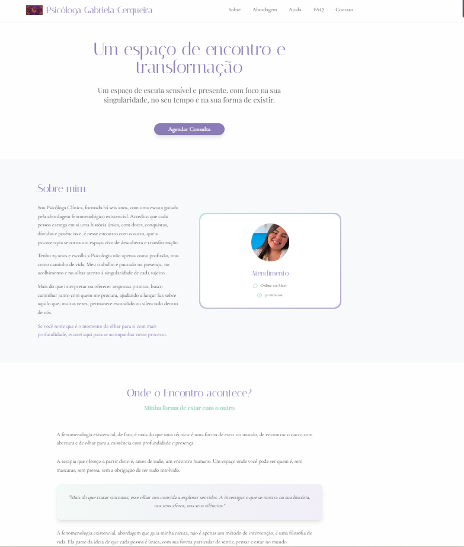

# 🌿 Site Profissional — Psicóloga Gabriela Cerqueira

Este repositório contém o código-fonte do site institucional da **Psicóloga Gabriela Cerqueira**, desenvolvido com foco em criar um espaço acolhedor, sensível e informativo para apresentar sua atuação na psicoterapia com abordagem fenomenológica.

## 🔗 Link do Site

👉 [terapiacomgabriela.netlify.app](https://terapiacomgabriela.netlify.app/#abordagem)

## 🖼️ Preview



> *“Um espaço de escuta sensível e presente, com foco na sua singularidade, no seu tempo e na sua forma de existir.”*

## 🎨 Identidade Visual

- **Cores principais**: Roxo, Verde Menta e Off White
- **Fonte destaque**: Italiana (combinada com Cormorant Garamond e Playfair Display)
- Estilo visual leve e elegante, com foco no bem-estar e acolhimento do visitante

## 🛠️ Tecnologias Utilizadas

- [Vite](https://vitejs.dev/)
- [TypeScript](https://www.typescriptlang.org/)
- [React](https://reactjs.org/)
- [Tailwind CSS](https://tailwindcss.com/)
- [shadcn/ui](https://ui.shadcn.com/)
- Deploy via [Netlify](https://www.netlify.com/)

## 💻 Como rodar o projeto localmente

1. Clone o repositório:
   ```bash
   git clone <SEU_GIT_URL>
